Voici une documentation complète expliquant comment compléter et utiliser ce fichier YAML pour générer un cluster Kubernetes directement via Terraform.

---

# Documentation pour la Génération d'un Cluster Kubernetes via Terraform

## Introduction

Ce guide explique comment configurer et utiliser un fichier YAML pour définir les paramètres nécessaires à la création d'un cluster Kubernetes sur une infrastructure Proxmox en utilisant Terraform. Les informations du fichier `vars/vars.yaml` seront utilisées par Terraform pour provisionner les machines virtuelles et configurer le cluster Kubernetes.

## Prérequis

Pour mettre en œuvre les configurations décrites, les prérequis suivants doivent être satisfaits :

- **Proxmox VE** : Accès administratif au serveur Proxmox VE où les VMs seront déployées. Le détail de la configuration du serveur proxmox est indiqué dans le fichier [la documentation dédiée](./docs/proxmox_role_guide.md)
- **Connectivité** : Accès réseau approprié pour permettre à Terraform de communiquer avec l'API de Proxmox.
- **Clés d'API** : Token API Proxmox nécessaire pour l'authentification.

## Structure du Fichier  `vars/vars.yaml`

Le fichier  `vars/vars.yaml` est divisé en deux sections principales : `GENERAL` et `NODES`. La section `GENERAL` contient des paramètres globaux pour le fournisseur Proxmox, tandis que la section `NODES` contient les informations spécifiques à chaque nœud du cluster Kubernetes.

### Section GENERAL

La section `GENERAL` définit les paramètres globaux pour le fournisseur Proxmox.

```yaml
GENERAL:
  # URL de l'API Proxmox
  PM_API_URL: https://my_proxmox_api_url:8006/api2/json
  
  # Identifiant du token API pour l'authentification
  PM_API_TOKEN_ID: "<your proxmox api token id>"
  
  # Secret du token API pour l'authentification
  PM_API_TOKEN_SECRET: "<your proxmox api token>"
  
  # Accepter les certificats TLS non sécurisés (auto-signés)
  PM_TLS_INSECURE: true
  
  # Activer le mode debug pour le fournisseur Proxmox
  PM_DEBUG: true
  
  # Masque de sous-réseau pour les adresses IP des VMs
  SUBNET_MASK: "16"
  
  # Utilisateur SSH pour la connexion aux VMs
  VM_SSH_USER: "<your ssh user>"
  
  # Clé SSH publique pour la connexion aux VMs
  VM_SSH_KEYS: "<your ssh key>"
```

### Section NODES

La section `NODES` définit les paramètres spécifiques pour chaque nœud du cluster Kubernetes.

```yaml
NODES: 
  TEST:
    # Nom du nœud
    NAME: "Test"
    
    # URL de l'API Proxmox pour ce nœud
    PM_API_URL: https://my_proxmox_api_url:8006/api2/json
            
    # Passerelle par défaut pour les VMs
    GW: 10.66.66.254
    
    # Nom du nœud Proxmox
    PROXMOX_NODE_NAME: "MY_PROXMOX_NODE"
    
    # Configuration spécifique à Kubernetes
    K8S:
      # Préfixe d'adresse IP pour les nœuds Kubernetes
      IP_PREFIX: 10.66.66
      
      # Nombre de nœuds maîtres
      MASTER_COUNT: 3
      
      # Nombre de nœuds de travail
      WORKER_COUNT: 3
```

## Compléter le Fichier  `vars/vars.yaml`

### Étape 1: Définir les Paramètres Globaux

Remplissez les valeurs dans la section `GENERAL` avec les informations de votre environnement Proxmox. Assurez-vous que les informations d'authentification sont correctes et que l'URL de l'API est accessible.

### Étape 2: Ajouter les Nœuds

Ajoutez les configurations des nœuds sous la section `NODES`. Chaque nœud doit avoir un nom unique et les paramètres spécifiques à ce nœud, y compris les adresses IP, la passerelle, et les informations spécifiques à Kubernetes.

## Configuration des Noeuds

Les éléments de configurations des noeuds master ou worker peuvent être mis a jour en éditant le fichier `terraform.tfvars`. Les valeurs renseignées par défauts suffiront dans une majorité de cas.
kubernetes_masters_node:

```sh
# Configuration des noeuds master
kubernetes_masters_node = {
  "master" : {
    # Nom de la machine virtuelle (VM) des maîtres Kubernetes.
    name         = "k8s-master",
    # Description de la configuration du maître Kubernetes.
    description  = "Kubernetes Master Configuration",
    # Hôte Proxmox où la VM sera créée. Cette valeur est surchargée par les valeur dans vars/vars.yaml
    host         = "",
    # Nom du template de base utilisé pour cloner la VM.
    clone        = "debian-base-pkr",
    # Nombre de cœurs CPU attribués à la VM.
    cpu_core     = "2",
    # Nombre de sockets CPU attribués à la VM.
    cpu_socket   = "2",
    # Quantité de mémoire (en Mo) attribuée à la VM.
    memory_mb    = "4096",
    # Taille du disque (en Go) attribué à la VM.
    disk_size_gb = "20",
    # Configuration IP de la VM. Cette valeur est surchargée par les valeur dans vars/vars.yaml
    ipconfig0    = "",
    # Utilisateur SSH pour accéder à la VM. Cette valeur est surchargée par les valeur dans vars/vars.yaml
    ssh_user     = ""

  }
}
# Configuration des noeuds worker
kubernetes_worker_node = {
  "worker" : {
    # Nom de la machine virtuelle (VM) des workers Kubernetes.
    name         = "k8s-node",
    # Description de la configuration des workers Kubernetes.
    description  = "Kubernetes Nodes configuration",
    # Hôte Proxmox où la VM sera créée. Cette valeur est surchargée par les valeur dans vars/vars.yaml
    host         = "",
    # Nom du template de base utilisé pour cloner la VM.
    clone        = "debian-base-pkr",
    # Nombre de cœurs CPU attribués à la VM.
    cpu_core     = "2",
    # Nombre de sockets CPU attribués à la VM.
    cpu_socket   = "4",
    # Quantité de mémoire (en Mo) attribuée à la VM.
    memory_mb    = "16384",
    # Taille du disque (en Go) attribué à la VM.
    disk_size_gb = "20",
    # Configuration IP de la VM. Cette valeur est surchargée par les valeur dans vars/vars.yaml
    ipconfig0    = "",
    # Utilisateur SSH pour accéder à la VM. Cette valeur est surchargée par les valeur dans vars/vars.yaml
    ssh_user     = ""
  }
}
```

---

## Utilisation avec un container Terraform

Il est recommandé de générer une image docker avec [le dockerfile fournit](./docker/Dockerfile). Cette image inclus l'ensemble des éléments et configurations de l'environnement de travail. La documentation détaillée liée à cette partie est disponible [ici](./docker/README.md) 

Le diagramme suivant représente l'utilisation recommandé du module: 

```mermaid
graph TD;
 
    A[DOCKERFILE] -->|Build| C[Docker Image terraform +@deps]
    C -->|Use| B[IASC]
    B --> |Générate| D[Image packer]
    B --> |Provision| E[Proxmox VMs] 
    B --> |Configure| F[Kubernetes Cluster]
    D --> |create| E
    E --> |Run| F 
```


### Construire l'Image Docker :

```sh
cd docker
docker build -t terraform-container
```

### Exécuter le Conteneur :

```sh
docker run --rm terraform-container
```
Cette commande affichera la version de Terraform pour vérifier que tout est correctement configuré.

### Initialiser et Appliquer Terraform

1. **Initialiser Terraform** :

    ```bash
    docker run --rm -v $(pwd)/:/workspace -w /workspace terraform-container init
    ```

2. **Appliquer la Configuration** :

    ```bash
    docker run --rm --network host -v $(pwd)/:/workspace -w /workspace terraform-container apply --auto-approve
    ```
Cette commande provisionnera les VMs sur Proxmox en utilisant les paramètres définis dans le fichier YAML.
## Utilisation avec Terraform

Dans le cas d'utilisateurs plus avancé, je vous invite a consulté [la documentation du code terraform](./kubernetes_cluster/README.md). Elle indique l'ensemble des prérequis nécessaire a l'utilisation du module.

### Initialiser et Appliquer Terraform

1. **Initialiser Terraform** :

    ```bash
    terraform init
    ```

2. **Appliquer la Configuration** :

    ```bash
    terraform apply
    ```

### Conclusion

En suivant ce guide, vous serez en mesure de configurer un fichier YAML pour définir les paramètres nécessaires à la création d'un cluster Kubernetes sur Proxmox via Terraform. Assurez-vous que toutes les informations sont correctement définies dans le fichier YAML et que la configuration Terraform est adaptée à votre environnement spécifique.