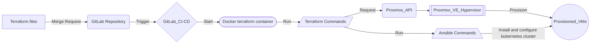

# Documentation de déploiement avec Terraform

Cette documentation détaille les étapes et les configurations nécessaires pour déployer des machines virtuelles dans un environnement Proxmox en utilisant Terraform. Elle inclut également des instructions pour la configuration de nœuds Kubernetes, illustrant un déploiement automatisé et scalable.
## Table des Matières

1. [Introduction](#introduction)
2. [Prérequis](#prérequis)
3. [Schéma de Fonctionnement](#schéma-de-fonctionnement)
4. [Configuration de Terraform](#configuration-de-terraform)
   - [Bloc Local](#bloc-local)
   - [Variables Proxmox](#variables-proxmox)
   - [Configuration des VMs](#configuration-des-vms)
   - [Configuration Kubernetes](#configuration-kubernetes)
5. [Déploiement et Gestion](#déploiement-et-gestion)
   - [Étapes de Déploiement](#étapes-de-déploiement)
   - [Rollback](#rollback)
   - [Mises à jour et Modifications](#mises-à-jour-et-modifications)
6. [Intégration de Terraform avec GitLab CI pour le Déploiement Automatisé](#intégration-de-terraform-avec-gitlab-ci-pour-le-déploiement-automatisé)
   - [Configuration de GitLab CI/CD](#configuration-de-gitlab-ci-cd)
   - [Détails de la Configuration](#détails-de-la-configuration)
   - [Sécurité et Gestion des Secrets](#sécurité-et-gestion-des-secrets)
   - [Avantages de l'Intégration de Terraform avec GitLab CI](#avantages-de-lintégration-de-terraform-avec-gitlab-ci)
7. [Sécurité et Maintenance](#sécurité-et-maintenance)
8. [Conclusion](#conclusion)

---

## Introduction

Le projet documenté ici se concentre sur l'orchestration de déploiements de VMs dans un environnement Proxmox à l'aide de Terraform, avec une attention particulière à la mise en place de nœuds pour un cluster Kubernetes. Cela permettra de bénéficier de la gestion de la configuration et de l'automatisation apportées par Terraform.

## Prérequis

Pour mettre en œuvre les configurations décrites, les prérequis suivants doivent être satisfaits :

- **Terraform** : Version 0.12 ou supérieure installée sur votre machine de contrôle.
- **Ansible** : Version 2.9 ou supérieure installée sur votre machine de contrôle.
- **Python** : Version 3.6 ou supérieure installée sur votre machine de contrôle. De plus, l'ensemble des dépendances et versions indiquées dans le fichier `./VMs/ansible/playbooks/kubespray/requirements.txt` doivent être satisfaites. Pour se faire, lancer la commande `pip install -r ./ansible/playbooks/kubespray/requirements.txt`
- **Proxmox VE** : Accès administratif au serveur Proxmox VE où les VMs seront déployées.
- **Connectivité** : Accès réseau approprié pour permettre à Terraform de communiquer avec l'API de Proxmox.
- **Clés d'API** : Token API Proxmox nécessaire pour l'authentification.

## Schéma de Fonctionnement

Ce schéma illustre comment Terraform interagit avec l'API Proxmox pour provisionner des ressources de manière automatisée :



## Configuration de Terraform

### `Locals`

Le `locals` contient des déclarations de configurations complexes qui sont réutilisées à plusieurs endroits dans le projet pour simplifier la maintenance et les ajustements :

## Introduction

Le bloc `locals` dans Terraform permet de définir des variables locales utilisées pour simplifier et structurer la configuration de Terraform. Dans ce cas, le bloc `locals` est utilisé pour définir des configurations pour les nœuds maîtres et les nœuds de travail Kubernetes, en utilisant des données provenant d'un fichier YAML.

## Variables Locales Définies

### `ZONES`

- **Description** : Charge et parse le fichier YAML `vars.yaml` pour extraire la liste des zones.
- **Type** : Carte (Map) d'objets
- **Source** : Fichier `vars.yaml`
- **Exemple de Contenu** :

### `master_provision`

- **Description** : Crée une liste aplatie de configurations pour les nœuds maîtres Kubernetes à partir des zones définies.
- **Type** : Liste d'objets
- **Structure de l'Objet** :
  ```hcl
  {
    site         = "TLS",
    master_name  = "TLS-k-master-01",
    proxmox_node = "TLS-NODE",
    ip           = "10.20.1.1",
    ip_param     = "24,gw=10.20.1.254"
  }
  ```
- **Détails** :
  - **`site`** : Nom de la zone.
  - **`master_name`** : Nom du nœud maître, formaté avec un suffixe numérique basé sur `instance_count`.
  - **`proxmox_node`** : Nom du nœud Proxmox où la VM sera créée.
  - **`ip`** : Adresse IP du nœud maître, construite à partir du préfixe IP et d'un compteur d'instances.
  - **`ip_param`** : Paramètres d'adresse IP pour la configuration cloud-init, incluant le masque de sous-réseau et la passerelle (gateway).

### `worker_provision`

- **Description** : Crée une liste aplatie de configurations pour les nœuds de travail Kubernetes à partir des zones définies.
- **Type** : Liste d'objets
- **Structure de l'Objet** :
  ```hcl
  {
    site         = "PAR",
    worker_name  = "PAR-k-worker-1",
    proxmox_node = "PAR-NODE",
    ip           = "10.20.2.51",
    ip_param     = "24,gw=10.20.2.254"
  }
  ```
- **Détails** :
  - **`site`** : Nom de la zone.
  - **`worker_name`** : Nom du nœud de travail, formaté avec un suffixe numérique basé sur `instance_count`.
  - **`proxmox_node`** : Nom du nœud Proxmox où la VM sera créée.
  - **`ip`** : Adresse IP du nœud de travail, construite à partir du préfixe IP et d'un compteur d'instances.
  - **`ip_param`** : Paramètres d'adresse IP pour la configuration cloud-init, incluant le masque de sous-réseau et la passerelle (gateway).

## Explication des Boucles `for`

### Boucle `master_provision`

Cette boucle crée une liste aplatie de configurations pour chaque nœud maître dans chaque zone définie. Elle itère sur chaque zone et génère un objet de configuration pour chaque nœud maître en fonction du nombre de maîtres défini dans le fichier YAML.

#### Exemple

Pour la zone `TLS` avec `MASTER_COUNT` de 3, la boucle génère :
- `TLS-k-master-01` avec IP `10.20.1.1`
- `TLS-k-master-02` avec IP `10.20.1.2`
- `TLS-k-master-03` avec IP `10.20.1.3`

### Boucle `worker_provision`

Cette boucle crée une liste aplatie de configurations pour chaque nœud de travail dans chaque zone définie. Elle itère sur chaque zone et génère un objet de configuration pour chaque nœud de travail en fonction du nombre de travailleurs défini dans le fichier YAML.

#### Exemple

Pour la zone `PAR` avec `WORKER_COUNT` de 3, la boucle génère :
- `PAR-k-worker-1` avec IP `10.20.2.51`
- `PAR-k-worker-2` avec IP `10.20.2.52`
- `PAR-k-worker-3` avec IP `10.20.2.53`


### Variables

#### Proxmox Variables

- `proxmox_url`: URL de l'API Proxmox.
- `proxmox_username`: Nom d'utilisateur pour se connecter à l'API Proxmox.
- `proxmox_token`: Token API pour l'authentification.
- `proxmox_node`: Nom du nœud Proxmox cible.

#### Kubernetes Master Node Variables

- `kubernetes_master_node.master.description`: Description du nœud maître Kubernetes.
- `kubernetes_master_node.master.cpu_core`: Nombre de cœurs CPU.
- `kubernetes_master_node.master.cpu_socket`: Nombre de sockets CPU.
- `kubernetes_master_node.master.memory_mb`: Taille de la mémoire en Mo.
- `kubernetes_master_node.master.ssh_user`: Nom d'utilisateur SSH.
- `kubernetes_master_node.master.disk_size_gb`: Taille du disque en Go.

#### Kubernetes Worker Node Variables

- `kubernetes_worker_node.worker.description`: Description du nœud de travail Kubernetes.
- `kubernetes_worker_node.worker.cpu_core`: Nombre de cœurs CPU.
- `kubernetes_worker_node.worker.cpu_socket`: Nombre de sockets CPU.
- `kubernetes_worker_node.worker.memory_mb`: Taille de la mémoire en Mo.
- `kubernetes_worker_node.worker.ssh_user`: Nom d'utilisateur SSH.
- `kubernetes_worker_node.worker.disk_size_gb`: Taille du disque en Go.

#### Autres Variables

- `vm_os_type`: Type de système d'exploitation de la VM.
- `vm_storage_class`: Classe de stockage de la VM.
- `vm_nameserver`: Serveur DNS.
- `vm_ssh_keys`: Clés SSH pour l'accès.

### Description des Ressources

- **proxmox_vm_qemu.kubernetes_masters** : Crée des VMs pour les nœuds maîtres Kubernetes sur Proxmox en utilisant un template Debian.
- **proxmox_vm_qemu.kubernetes_workers** : Crée des VMs pour les nœuds de travail Kubernetes sur Proxmox en utilisant un template Debian.
- **local_file.ansible_inventory** : Génère un fichier d'inventaire Ansible pour Kubespray à partir des adresses IP des VMs créées.
- **null_resource.kubernetes_cluster_creation** : Utilise Ansible pour déployer un cluster Kubernetes en exécutant le playbook Kubespray avec le fichier d'inventaire généré.

### Notes

- **Clés SSH** : Assurez-vous que les clés SSH (`var.vm_ssh_keys`) sont correctement configurées pour permettre la connexion SSH aux VMs.
- **Fichier de Template** : Le fichier de template Ansible `inventory.tpl` doit être correctement configuré pour générer un inventaire compatible avec Kubespray.
- **Variables d'Environnement** : Les variables d'environnement utilisées dans le provisioner `local-exec` doivent être sécurisées et ne doivent pas contenir de mots de 

---

## Déploiement et Gestion

### Déploiement des Ressources avec Terraform

#### Étapes de Déploiement

1. **Initialisation de Terraform**:
   - Exécutez `terraform init` dans votre répertoire de projet pour initialiser le répertoire de travail de Terraform. Cette commande télécharge et installe le provider Terraform nécessaire, prépare votre répertoire de travail pour d'autres commandes, et configure le backend pour la gestion de l'état.

2. **Validation de la Configuration**:
   - Avant d'appliquer la configuration, utilisez `terraform validate` pour s'assurer qu'il n'y a pas d'erreurs dans les fichiers de configuration.

3. **Planification du Déploiement**:
   - Exécutez `terraform plan` pour voir quelles actions Terraform exécutera lors de l'application de la configuration. Cette étape est cruciale pour comprendre les modifications qui seront apportées à votre infrastructure avant de les appliquer effectivement.

4. **Application des Changements**:
   - Utilisez `terraform apply` pour appliquer les changements requis pour atteindre l'état désiré. Cette commande affiche un plan d'exécution et vous demande de l'approuver avant de procéder à l'exécution.

5. **Vérification**:
   - Après le déploiement, vérifiez que toutes les ressources ont été correctement créées et configurées comme prévu.

#### Rollback

- En cas d'échec ou de résultats inattendus, Terraform permet de revenir à un état précédent à l'aide de la commande `terraform destroy` qui supprimera les ressources définies dans les fichiers de configuration.

### Gestion et Maintenance

#### Mises à jour et Modifications

- Pour mettre à jour ou modifier les configurations, ajustez les fichiers de configuration Terraform puis répétez le processus de planification et d'application.
- Assurez-vous de tester toutes les modifications dans un environnement de préproduction avant de les appliquer en production.

## Intégration de Terraform avec GitLab CI pour le Déploiement Automatisé

L'utilisation de GitLab CI/CD avec Terraform offre une méthode robuste pour automatiser le déploiement et la gestion des infrastructures. Voici comment configurer un pipeline CI/CD dans GitLab pour déployer vos ressources Terraform.

### Configuration de GitLab CI/CD

#### Fichier `.gitlab-ci.yml`

Pour automatiser le processus de déploiement avec Terraform dans GitLab, vous devez créer un fichier `.gitlab-ci.yml` à la racine de votre projet Terraform. Ce fichier définira les étapes du pipeline qui testent, construisent, et déploient vos configurations Terraform.

Voici un exemple de configuration de base pour le fichier `.gitlab-ci.yml`:

```yaml
stages:
  - validate
  - plan
  - deploy

image: hashicorp/terraform:latest

before_script:
  - terraform init

validate:
  stage: validate
  script:
    - terraform validate
  only:
    - branches

plan:
  stage: plan
  script:
    - terraform plan
  only:
    - merge_requests

deploy:
  stage: deploy
  script:
    - terraform apply -auto-approve
  when: manual
  only:
    - master
```

### Détails de la Configuration

- **Stages** : Définit les étapes du pipeline. Chaque étape exécute différentes commandes de Terraform:
  - `validate` : Vérifie que les fichiers Terraform sont valides.
  - `plan` : Crée un plan d'exécution Terraform, utile pour les revues de code dans les merge requests.
  - `deploy` : Applique les modifications Terraform à l'infrastructure. Ce stage peut être configuré pour s'exécuter manuellement comme une approbation finale.
  
- **Image** : Utilise l'image Docker officielle de Terraform pour exécuter les commandes.

- **`before_script`** : Commande `terraform init` exécutée avant les scripts de chaque stage pour initialiser le répertoire de travail Terraform.

- **Conditions d'exécution** :
  - La validation s'exécute automatiquement sur toutes les branches pour s'assurer que chaque commit est valide.
  - Le plan n'est exécuté que pour les merge requests pour prévisualiser les changements.
  - Le déploiement est restreint à la branche `master` et requiert une intervention manuelle pour une sécurité accrue.

### Sécurité et Gestion des Secrets

Dans GitLab, il est crucial de gérer les secrets (comme les clés API) de manière sécurisée. Utilisez les **Variables CI/CD** de GitLab pour stocker les valeurs sensibles :

1. **Naviguez vers Settings > CI / CD** dans votre projet GitLab.
2. **Développez la section Variables** et ajoutez vos secrets ici. Ces variables sont ensuite injectées dans l'environnement d'exécution du pipeline.

### Avantages de l'Intégration de Terraform avec GitLab CI

- **Automatisation** : Réduit les erreurs humaines en automatisant la création, le test, et le déploiement des infrastructures.
- **Traçabilité** : Chaque étape du processus est enregistrée, offrant une piste d'audit complète de ce qui a été déployé et quand.
- **Sécurité** : Permet une révision systématique des changements d'infrastructure avant leur déploiement, améliorant ainsi la conformité et la sécurité.

En intégrant Terraform avec GitLab CI, les équipes peuvent améliorer significativement leur efficacité, leur précision et leur conformité lors du déploiement d'infrastructures. Cette approche facilite également la collaboration et l'accélération des cycles de déploiement tout en maintenant un contrôle strict sur l'environnement de production.


